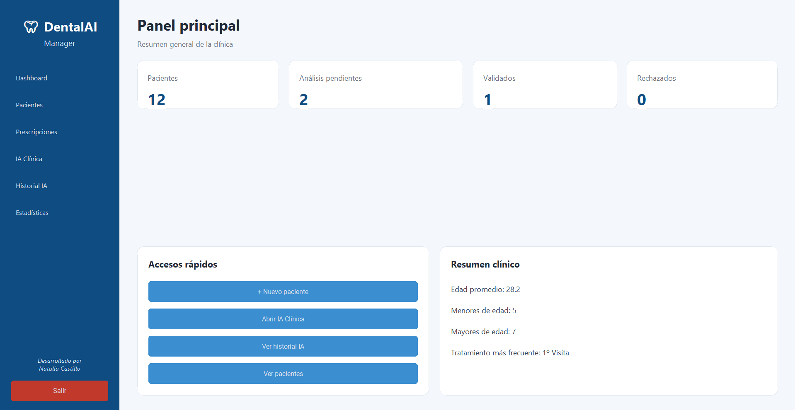
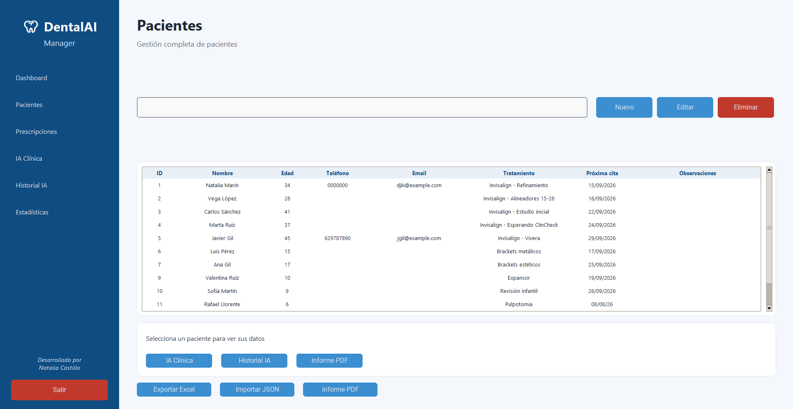
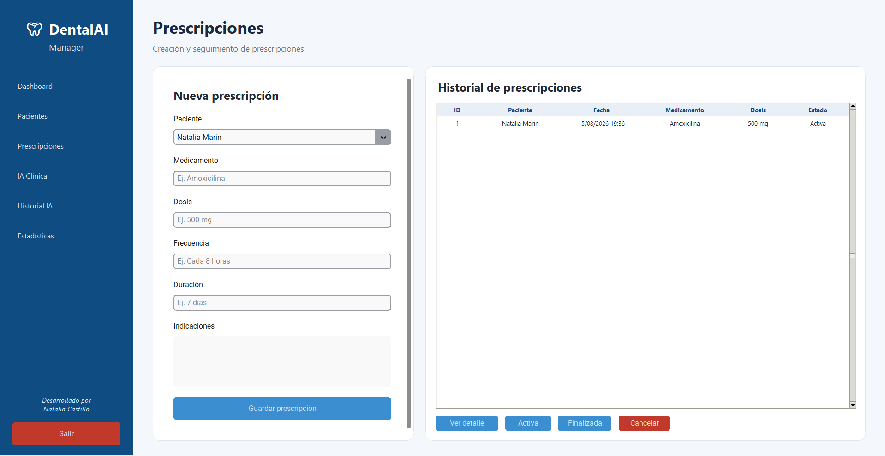
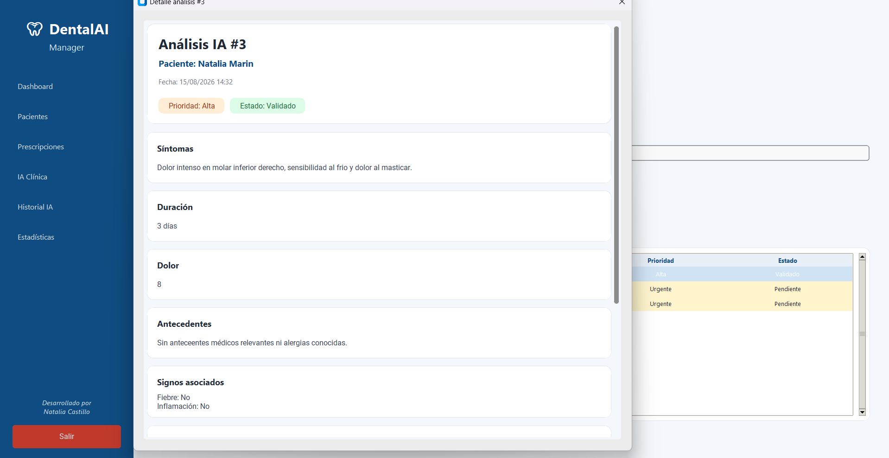
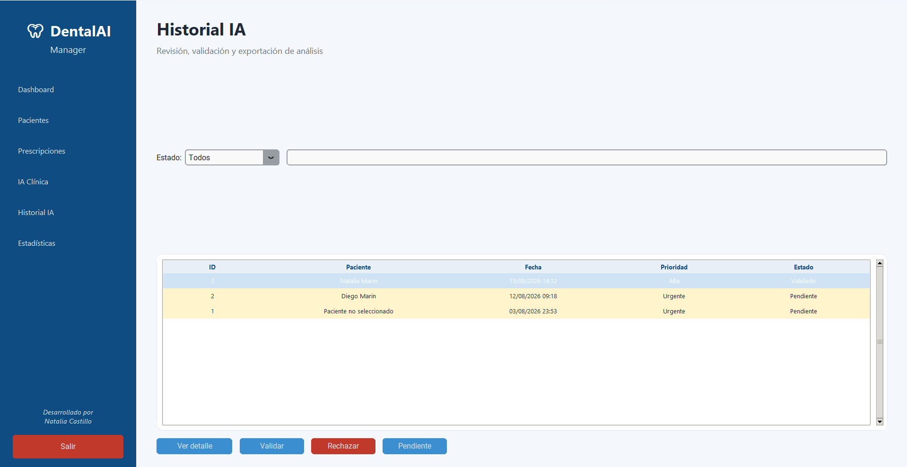

# 🦷 DentalAI Manager

Aplicación de escritorio para la gestión de clínicas dentales desarrollada en **Python**, con una interfaz gráfica moderna, almacenamiento local mediante **SQLite** y funcionalidades de apoyo clínico y automatización documental.

DentalAI Manager es un proyecto de portfolio orientado a demostrar la integración de desarrollo de software, bases de datos, interfaces gráficas, generación de documentos y funcionalidades de inteligencia artificial en una aplicación funcional.

## ✨ Funcionalidades

### 👥 Gestión de pacientes
- Alta de pacientes
- Edición y eliminación de registros
- Búsqueda de pacientes
- Consulta de información almacenada
- Teléfono, email y observaciones
- Importación de datos desde JSON
- Exportación de datos a Excel
- Generación de informes PDF

### 💊 Prescripciones
- Creación de prescripciones asociadas a pacientes
- Registro de medicamento, dosis, frecuencia y duración
- Indicaciones para el paciente
- Historial de prescripciones
- Consulta detallada de cada prescripción
- Gestión del estado de las prescripciones
- Persistencia de datos mediante SQLite

### 🤖 IA Clínica
- Módulo de apoyo al análisis clínico
- Registro de síntomas y duración
- Nivel de dolor
- Antecedentes relevantes
- Registro de fiebre e inflamación
- Generación de valoración orientativa
- Priorización del caso
- Sugerencia de pruebas
- Identificación de señales de alarma
- Almacenamiento de los análisis realizados

> Los resultados generados por el módulo de IA son orientativos y requieren siempre validación profesional.

### 📋 Historial IA
- Consulta de análisis realizados
- Búsqueda por paciente
- Filtrado por estado
- Estados Pendiente, Validado y Rechazado
- Vista detallada de cada análisis
- Exportación del análisis a PDF

### 📄 Informes clínicos
- Generación de documentación clínica en PDF
- Informes asociados a pacientes
- Informes de análisis realizados
- Integración con los datos almacenados en SQLite

### 📊 Dashboard y estadísticas
- Panel principal con contadores basados en los datos almacenados
- Número de pacientes registrados
- Análisis pendientes, validados y rechazados
- Edad promedio
- Distribución entre pacientes menores y adultos
- Tratamiento más frecuente

## 🛠️ Tecnologías utilizadas
- **Python**
- **CustomTkinter** — interfaz gráfica
- **Tkinter / ttk**
- **SQLite** — almacenamiento local de datos
- **OpenPyXL / Excel** — exportación de información
- **JSON** — importación de información
- **PDF** — generación automatizada de informes
- **Git & GitHub** — control de versiones
- **FastAPI** — API REST
- **Uvicorn** — servidor ASGI para ejecutar la API

## 📁 Estructura principal

```text
DentalAI_Manager_v2/
├── app.py
├── database.py
├── copilot_logic.py
├── pdf_utils.py
├── requirements.txt
├── run.bat
├── README.md
└── screenshots/
    ├── dashboard.png
    ├── pacientes.png
    ├── prescripciones.png
    ├── historial_ia.png
    └── detalle_ia.png
```

### `app.py`
Interfaz principal de la aplicación y conexión entre los diferentes módulos.

### `database.py`
Gestión de la base de datos SQLite y operaciones relacionadas con pacientes, análisis y prescripciones.

### `copilot_logic.py`
Lógica utilizada por el módulo de IA clínica.

### `pdf_utils.py`
Generación de informes y documentación en formato PDF.

## 🚀 Instalación

Clona el repositorio:

```bash
git clone <URL_DEL_REPOSITORIO>
cd DentalAI-Manager
```

Instala las dependencias:

```bash
pip install -r requirements.txt
```

Ejecuta la aplicación:

```bash
python app.py
```
### Ejecutar la API REST

```bash
uvicorn api:app --reload

## 🖥️ Capturas de pantalla

### Dashboard


### Gestión de pacientes


### Prescripciones


### Historial de IA


### Detalle de análisis IA


> Todos los pacientes y datos mostrados en las capturas son ficticios y se utilizan exclusivamente con fines demostrativos.

## 🔒 Privacidad y datos

DentalAI Manager utiliza una base de datos **SQLite local**.

Los archivos de base de datos (`*.db`) deben permanecer excluidos del control de versiones mediante `.gitignore`.

El repositorio público no debe contener información clínica real ni datos personales de pacientes. Los datos utilizados para demostraciones y capturas del proyecto son ficticios.

## ⚠️ Aviso

DentalAI Manager es un proyecto de software desarrollado con fines educativos y de portfolio.

Las funcionalidades relacionadas con análisis clínico y prescripciones no sustituyen el criterio, diagnóstico o supervisión de un profesional sanitario.

## 🗺️ Próximas mejoras
- Ampliación de las funcionalidades de IA
- Mejora de estadísticas y visualizaciones
- Exportación avanzada de prescripciones
- Sistema de autenticación y usuarios
- Mejoras adicionales de seguridad y validación de datos
- Evolución de la arquitectura de la aplicación

## 📌 Estado del proyecto

**Versión funcional en desarrollo activo.**

Actualmente integra gestión de pacientes, prescripciones, IA clínica, historial de análisis, generación de PDF, importación/exportación de datos y estadísticas.

## 🎯 Objetivo del proyecto

Proyecto desarrollado como parte de un portfolio técnico para demostrar conocimientos prácticos en:

- Desarrollo con Python
- Programación orientada a objetos
- Diseño de interfaces gráficas
- Bases de datos SQLite
- Operaciones CRUD
- Persistencia de datos
- Generación de documentos
- Importación y exportación de información
- Integración de lógica de IA
- Organización modular de una aplicación
- Git y control de versiones

```

## 📸 Capturas de pantalla

### Panel principal


### Gestión de pacientes


### Prescripciones


### Asistente IA


### Historial IA
