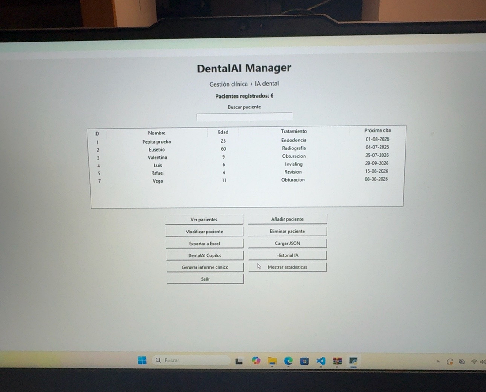
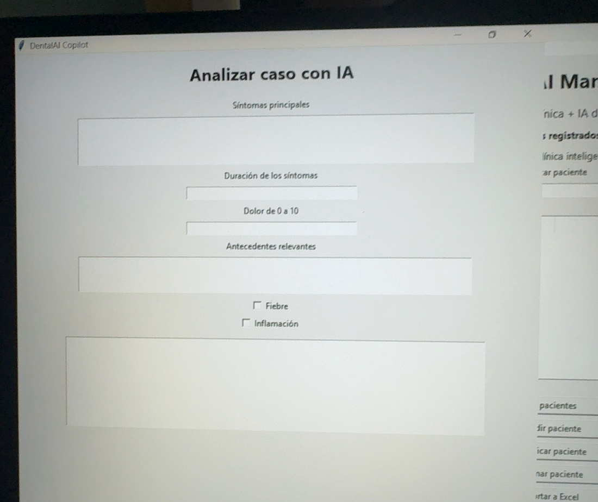
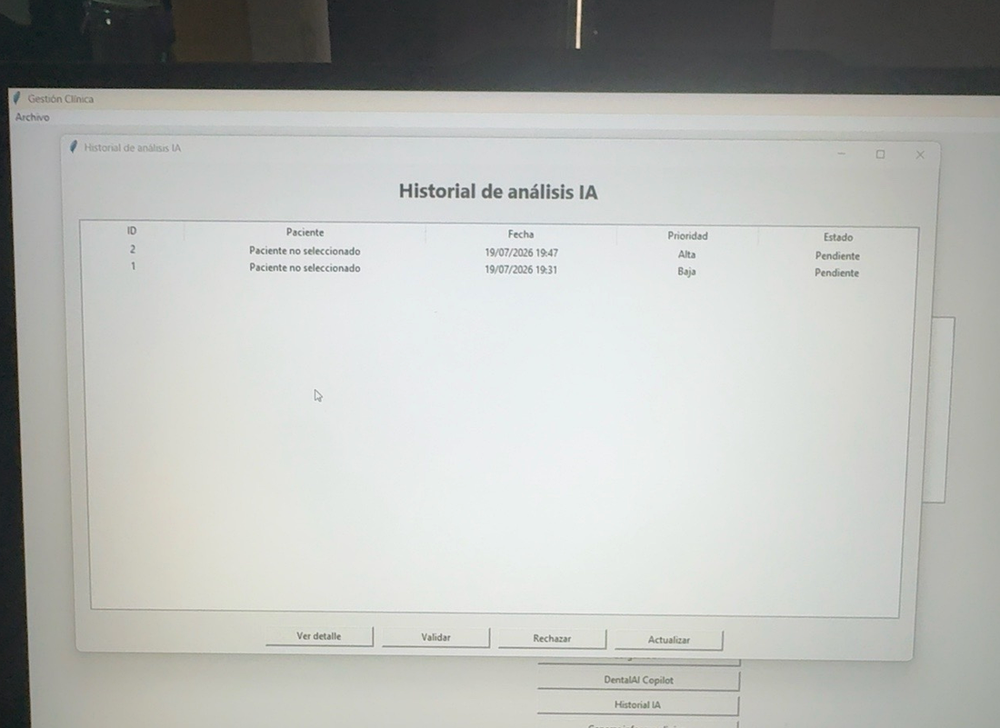
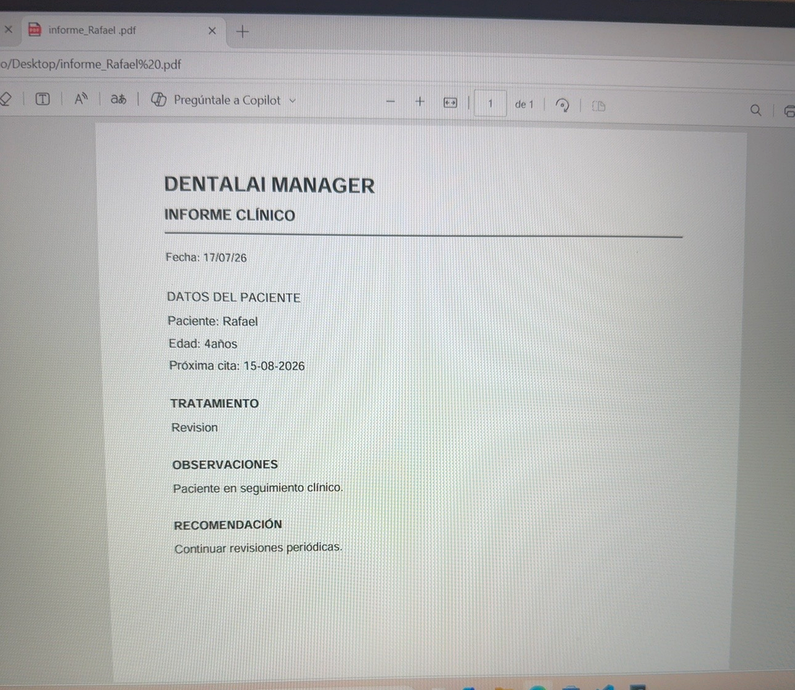

# DentalAI Manager

Aplicación de escritorio para **gestión clínica dental** desarrollada en Python. El proyecto combina gestión de pacientes, persistencia con SQLite, exportaciones a Excel y PDF y un copiloto clínico orientativo con historial, trazabilidad y validación profesional.

> Proyecto personal desarrollado por una higienista bucodental y estudiante de Desarrollo de Aplicaciones Web. La IA se utilizó como apoyo para planificar, depurar y revisar partes del código; las decisiones funcionales, pruebas y adaptación al entorno clínico forman parte del desarrollo del proyecto.

## Qué problema resuelve

En una clínica dental es necesario centralizar información de pacientes, tratamientos, próximas citas e informes. DentalAI Manager permite realizar estas tareas desde una interfaz sencilla y añade un módulo de apoyo clínico orientativo que clasifica casos por prioridad y conserva el historial de cada análisis.

El objetivo no es sustituir el criterio profesional, sino demostrar cómo una aplicación puede combinar:

- gestión de datos clínicos;
- automatización de documentos;
- reglas de apoyo a la decisión;
- trazabilidad de resultados;
- validación humana.

## Funcionalidades principales

### Gestión de pacientes

- Alta, modificación y eliminación de pacientes.
- Búsqueda por nombre.
- Registro de edad, tratamiento y próxima cita.
- Persistencia de datos en SQLite.
- Importación de pacientes desde JSON.

### Exportación y documentación

- Exportación del listado de pacientes a Excel.
- Generación de informes clínicos en PDF.
- Exportación del detalle de análisis IA a PDF.

### DentalAI Copilot

- Registro de síntomas, duración, intensidad del dolor y antecedentes.
- Indicadores de fiebre e inflamación.
- Clasificación de prioridad: Baja, Media, Alta o Urgente.
- Valoración orientativa, pruebas sugeridas y señales de alarma.
- Asociación del análisis al paciente seleccionado.
- Guardado completo del análisis en SQLite.

### Historial y validación profesional

- Historial de análisis IA.
- Búsqueda por paciente.
- Filtro por estado.
- Estados: Pendiente, Validado y Rechazado.
- Visualización del detalle completo.
- Cambio de estado con confirmación.
- Contadores por estado.

### Estadísticas

- Número total de pacientes.
- Edad media.
- Número de pacientes menores y mayores de edad.
- Tratamiento más frecuente.

## Capturas

### Pantalla principal



### DentalAI Copilot



### Historial de análisis IA



### Informe clínico en PDF



## Tecnologías utilizadas

- Python 3
- Tkinter
- SQLite
- OpenPyXL
- ReportLab
- Git y GitHub

## Arquitectura del proyecto

```text
DentalAI_Manager_organizado/
├── app.py               # Interfaz gráfica y coordinación de la aplicación
├── database.py          # Creación de tablas y operaciones SQLite
├── copilot_logic.py     # Reglas del análisis clínico orientativo
├── pdf_utils.py         # Generación de informes PDF
├── requirements.txt     # Dependencias externas
├── run.bat              # Inicio rápido en Windows
├── screenshots/         # Capturas utilizadas en el README
├── GUIA_ENTREVISTA.md   # Guía para explicar y defender el proyecto
├── clinica.db           # Base de datos local
└── README.md
```

La separación por módulos evita concentrar toda la lógica en un único archivo y facilita el mantenimiento, las pruebas y futuras ampliaciones.

## Flujo de datos

1. La interfaz recoge los datos introducidos por el usuario.
2. `app.py` valida la información básica.
3. `database.py` guarda o recupera los datos de SQLite.
4. `copilot_logic.py` procesa los datos clínicos mediante reglas transparentes.
5. El resultado se guarda con fecha, paciente, prioridad y estado.
6. Un profesional puede validar o rechazar el análisis desde el historial.
7. `pdf_utils.py` genera documentos exportables.

## Instalación

### 1. Clonar o descargar el proyecto

```bash
git clone URL_DEL_REPOSITORIO
cd DentalAI_Manager_organizado
```

### 2. Instalar dependencias

```bash
pip install -r requirements.txt
```

### 3. Ejecutar

```bash
python app.py
```

En Windows también puede iniciarse con doble clic sobre:

```text
run.bat
```

## Ejemplo de uso

1. Seleccionar un paciente en la pantalla principal.
2. Abrir **DentalAI Copilot**.
3. Introducir los síntomas y datos clínicos.
4. Pulsar **Analizar caso**.
5. Revisar prioridad, valoración y señales de alarma.
6. Guardar el análisis.
7. Abrir **Historial IA** para validar, rechazar o exportar el resultado.

## Decisiones técnicas

### SQLite

Se eligió SQLite porque permite conservar los datos localmente sin instalar un servidor de bases de datos. Es apropiado para un prototipo de escritorio y facilita practicar consultas SQL, inserciones, actualizaciones y filtros.

### Tkinter

Tkinter permite crear una aplicación funcional de escritorio utilizando únicamente Python. Para una evolución comercial, la interfaz podría migrarse a una aplicación web o a un framework visual más avanzado.

### Motor orientativo basado en reglas

La versión actual no utiliza un modelo generativo externo. Emplea reglas explícitas y verificables para que cada resultado sea trazable y fácil de explicar. Esto permite demostrar lógica condicional, validación de datos y diseño responsable.

## Uso responsable y limitaciones

DentalAI Copilot es una herramienta educativa y de portfolio.

- No realiza diagnósticos.
- No sustituye la valoración de un odontólogo.
- Los resultados son orientativos.
- Todos los análisis requieren validación profesional.
- La base de datos incluida debe utilizar únicamente datos ficticios.
- El proyecto no está preparado para almacenar datos sanitarios reales ni cumple por sí solo requisitos legales de producción.

## Mejoras futuras

- Autenticación y diferentes roles de usuario.
- Cifrado y protección de datos.
- Registro de auditoría de cambios.
- Pruebas automatizadas.
- Validación avanzada de fechas.
- Interfaz web responsive.
- API backend.
- Integración opcional con un modelo de lenguaje usando salidas estructuradas.
- Fuentes clínicas y sistema RAG para justificar las recomendaciones.
- Panel de métricas y gráficos.

## Qué demuestra este proyecto

- Programación estructurada en Python.
- Desarrollo de interfaces gráficas.
- Diseño y uso de una base de datos relacional.
- Operaciones CRUD.
- Validación y tratamiento de errores.
- Generación de archivos Excel y PDF.
- Separación de responsabilidades en módulos.
- Aplicación de conocimiento del sector dental a un proyecto tecnológico.
- Uso responsable de herramientas de IA durante el desarrollo.

## Autora

**Natalia Castillo**  
Higienista bucodental y estudiante de Desarrollo de Aplicaciones Web.

Proyecto creado para unir experiencia clínica, programación y aplicación práctica de inteligencia artificial en el sector dental.
